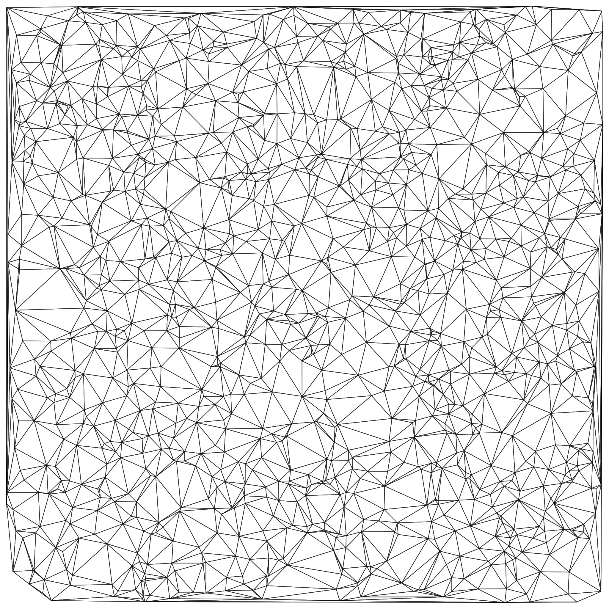
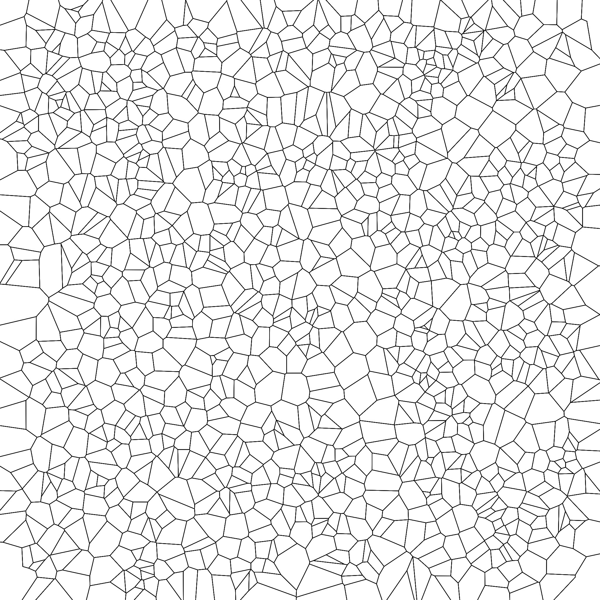

# Delaunay

## Description

Natively parallel implementation of Dwyer's modification to the classic divide and conquer algorithm. Written in C and build-tested on both Windows and Linux. Linux builds were tested with both GCC and Clang; Windows with ONLY MinGW.

The main file just generates some amount of nodes at random, then triangulates them and writes the triangulation and associated Voronoi diagram to the current directory (images are written using [STB's image library](https://github.com/nothings/stb)). All of the code in main.c and delaunay_img.c exists for this purpose, and is not necessary to the triangulation.

Geometric primitives (in geometry.c) are written in both standard C and with x86 intrinsics. Intrinsics are enabled by default; build with `-DNO_INTRINSICS` to disable them.

## Sources

- [Jonathan Shewchuk's triangular data structure](http://www.personal.psu.edu/cxc11/AERSP560/DELAUNEY/10_Triangulation_Shewchuk.pdf)
- [Rex A. Dwyer's modification to the classic algorithm](https://doi.org/10.1145/10515.10545)
- [Guibas and Stolfi's classic algorithm itself](https://doi.org/10.1145/282918.282923)